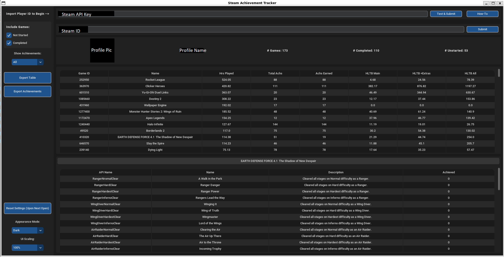

# Steam Achievement Tracker

## A project designed to aid achievement hunters in figuring out which owned games to play next and generate .csv files with the achievements.

## Features:
- View Games owned by a steam profile
- View howlongtobeat data for each game
- View Achievements Status and Details
- Export Game Tables or Achievments for a game to a .csv
- Windows v1.1 has a log file stored in C:\ProgramData\AchievementHelper

## Requirements:
- You will need a Steam API Key, there is a button in the GUI that will provide the link
- You will also need your profile's Steam ID (instructions in the app)

## Installation
- For Windows you can use the installer
- Alternatively you can download the source code and run in your own environment, the Linux is not updated as much as the Windows.

## Main Resources Used
- CustomTkinter (https://github.com/TomSchimansky/CustomTkinter)
- CTkTable (https://github.com/Akascape/CTkTable)
- HowLongToBeat Python API (https://pypi.org/project/howlongtobeatpy/)
  
## Updates
- Version 1.1 (13 September) fixed an issue where a game had hidden achievements not accessible to the user, fixes causing freezes and crashing, introduction of a log file and general code cleanup.
  
### Hopefully you found some use from this (I know it's not pretty code), and if you want to donate you can find me at cash.app/$werd780 
